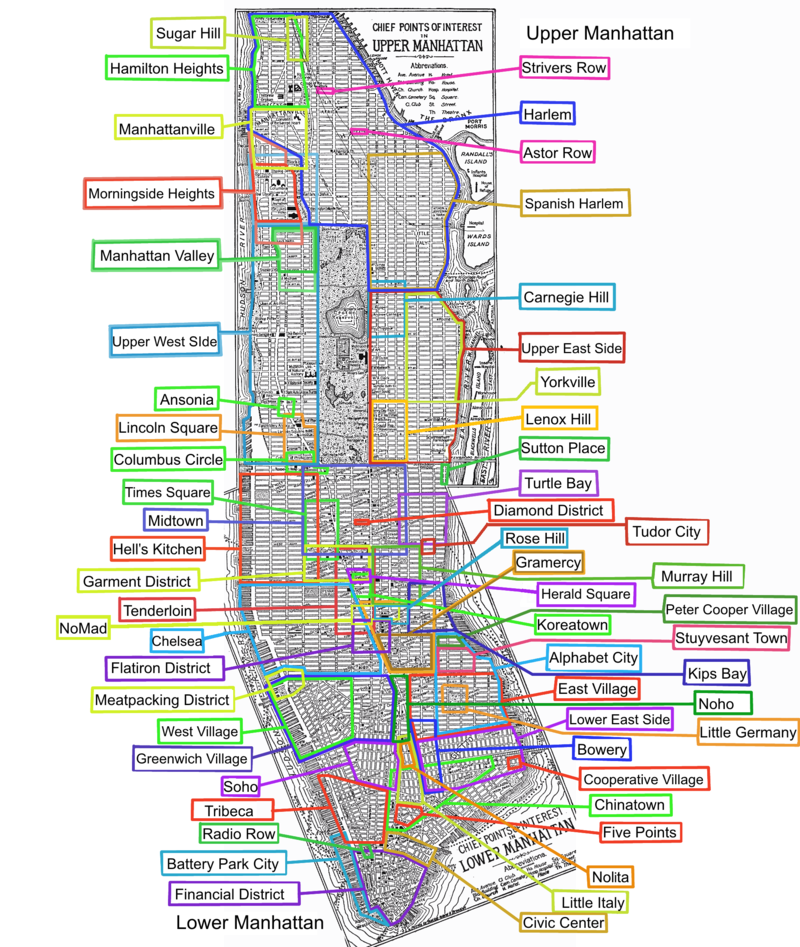

# New York City

New York City is much like the the city of which it is [modeled after](https://en.wikipedia.org/wiki/New_York_City) in the real world.  Almost all of the buildings in the world are fictional peices of work.  Though some famous places are used.  The biggest difference is how the supernatural undercurrents lie with in the City itself.  The differences from [the real world](https://www.nycgo.com/) are what we will focus on.  All persons used are fictional, especially those in any [position of power](https://www1.nyc.gov/).

## Territories

North of Central park including Harlem is Vampire territory  
South of Central park is Manhattan Wolf Pack territory  
Hell's Kitchen is Lone Wolf Pack territory
Upper East & West sides including Central park (middle section of Manhattan island) is Neutral/Venatori controlled territory  

## Locations

The Apex Unlimted Building  
The Night Life Building  
Bonnie's Dinner  
Fiore  
Aspect  
Flit  
Ooh  
Turtle Dove  
Lenard's Fish Mart  
The Ugly Dog Saloon  
Safe Harbor  
V & M  

